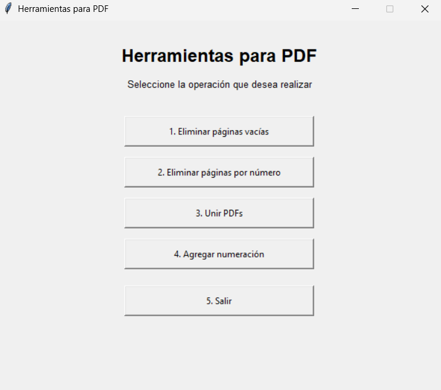
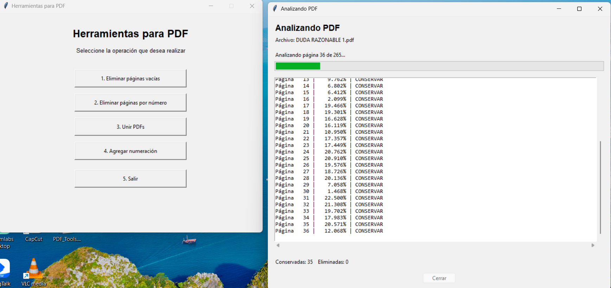
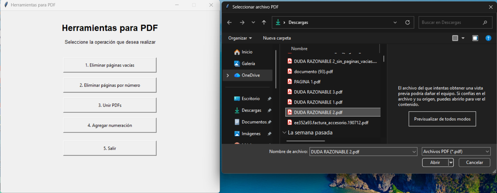
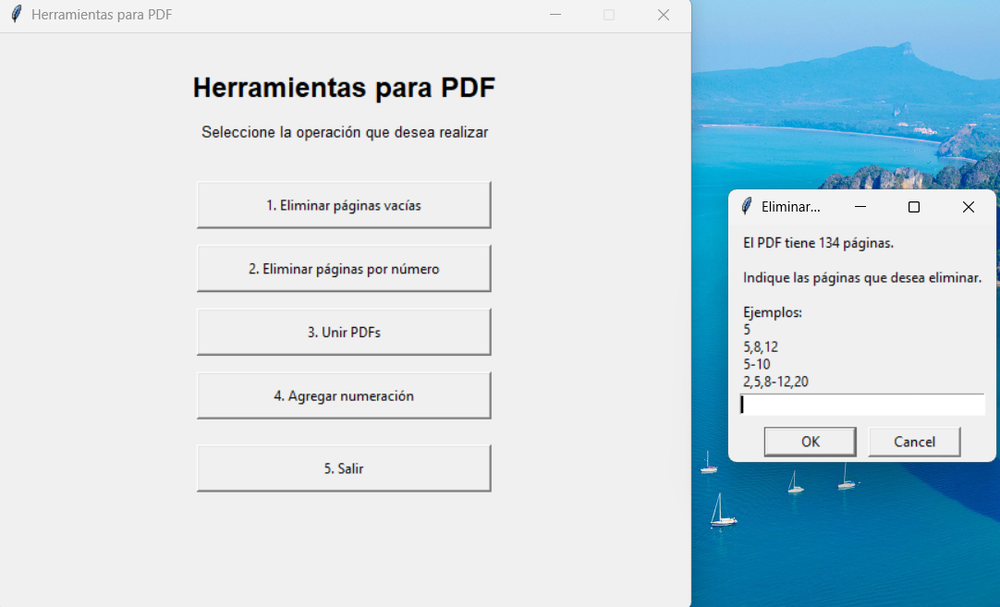
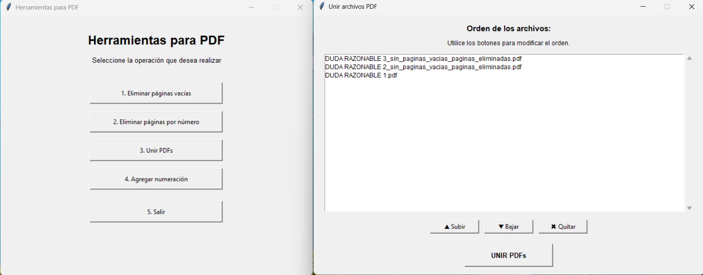
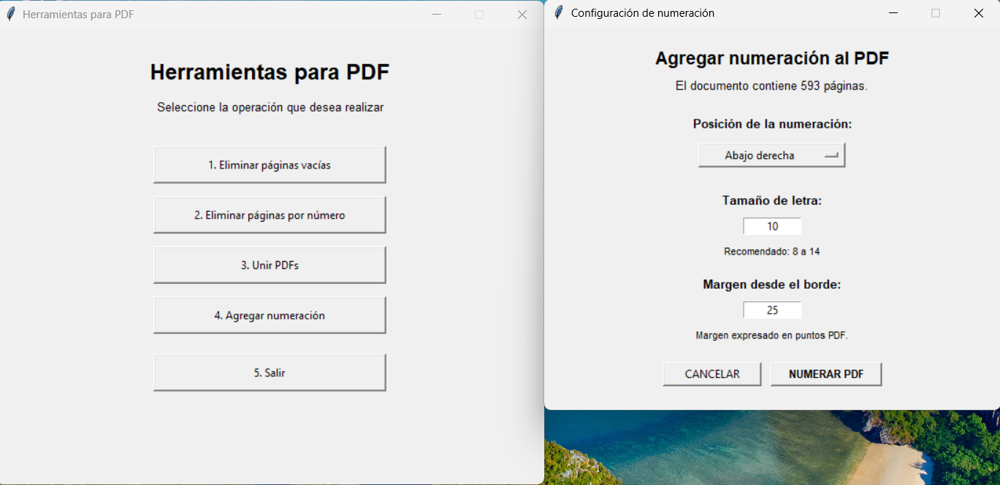
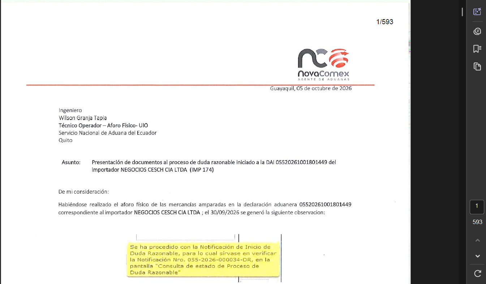
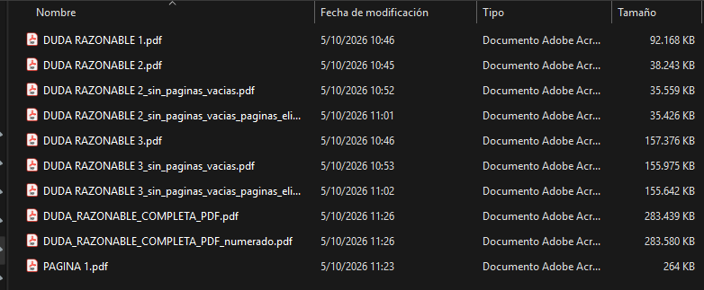

# PDF Tools

> Aplicación de escritorio para realizar tareas puntuales de organización y preparación de documentos PDF.

PDF Tools ofrece una interfaz gráfica en español para eliminar páginas vacías, quitar páginas por número, combinar varios documentos y agregar numeración. Está desarrollada en Python con Tkinter y PyMuPDF. Incluye además una utilidad de consola independiente para detectar páginas en blanco.

> **Estado de documentación:** este documento describe las funciones que implementa el código fuente. Las imágenes definidas como ejemplos prácticos y funcionales se encuentran en `docs/capturas/`. (Ver [Capturas de pantalla](#capturas-de-pantalla)).

## Contenido

- [Funciones](#funciones)
- [Requisitos](#requisitos)
- [Ejecución](#ejecución)
- [Uso de la aplicación](#uso-de-la-aplicación)
- [Detalle de las operaciones](#detalle-de-las-operaciones)
- [Archivos generados](#archivos-generados)
- [Estructura del proyecto](#estructura-del-proyecto)
- [Compilar el ejecutable](#compilar-el-ejecutable)
- [Limitaciones y notas](#limitaciones-y-notas)
- [Capturas de pantalla](#capturas-de-pantalla)

## Funciones

| Opción | Descripción |
| --- | --- |
| Eliminar páginas vacías | Renderiza cada página y estima si contiene marcas no blancas. Conserva las páginas que superan el umbral configurado. |
| Eliminar páginas por número | Permite indicar páginas individuales o rangos, confirma la selección y crea un PDF con las páginas restantes. |
| Unir PDFs | Selecciona varios PDFs, permite reordenarlos o quitarlos de la lista y guarda un único documento en el orden seleccionado. |
| Agregar numeración | Inserta en cada página una etiqueta con el formato `página/total`, con selección de esquina, tamaño de letra y margen. |

Las operaciones generan documentos nuevos con sufijos en el nombre. No se sobrescribe deliberadamente el archivo seleccionado.

## Requisitos

- Windows, macOS o Linux con un entorno gráfico compatible con Tkinter. El ejecutable distribuido en `dist/` es para Windows, actualmente.
- Python 3.10 o posterior recomendado.
- Tkinter, normalmente incluido en la distribución estándar de Python (en algunas distribuciones Linux debe instalarse como paquete del sistema).
- Dependencias Python:
  - [PyMuPDF](https://pymupdf.readthedocs.io/) (`fitz`), para leer, modificar, renderizar y guardar PDFs.
  - [Pillow](https://python-pillow.org/) (`PIL`), para analizar las imágenes de las páginas vacías.

Instalación de dependencias desde la raíz del proyecto:

```bash
python -m pip install PyMuPDF Pillow
```

No hay actualmente un archivo `requirements.txt`; los paquetes anteriores se deducen de las importaciones del código.

## Ejecución

### Desde Python

En una terminal abierta en la carpeta del proyecto:

```bash
python main.py
```

En Windows también puede utilizarse `py main.py`, según la instalación de Python.

### Ejecutable de Windows

Si se dispone de la compilación incluida, iniciar `dist/PDF_Tools.exe` con doble clic.

## Uso de la aplicación

1. Iniciar la aplicación. La ventana principal presenta cuatro operaciones y la opción de salir.
2. Elegir una operación. Los cuadros de diálogo permiten seleccionar el PDF de entrada o los archivos que se procesarán.
3. Completar las opciones que solicita esa operación. Algunas tareas piden una confirmación antes de modificar el documento en memoria.
4. Esperar el mensaje de resultado. Cuando corresponda, este indica la ruta del nuevo PDF, un mensaje de alerta/error o una confirmación de la tarea completada exitosamente.
5. Abrir el archivo generado con un visor de PDF para revisar visualmente el resultado.

Cancelar un selector o una confirmación abandona esa acción sin guardar el PDF de salida.

## Detalle de las operaciones

### 1. Eliminar páginas vacías

Selecciona un PDF y analiza cada página como imagen (en este caso se trabaja directamete con archivos escaneados) en escala de grises a 120 DPI (puntos por pulgada). Cuenta los píxeles con valor inferior a 245 (es decir, más oscuros que un blanco casi puro). Si esos píxeles representan al menos el `0,10 %` de la página, la página se considera con contenido; de lo contrario, se clasifica como vacía. El resultado se construye copiando las páginas conservadas en su orden original.

El programa informa cuántas páginas se conservaron y eliminaron. Si no detecta páginas vacías, muestra un mensaje y no crea un documento adicional. El análisis es visual y basado en umbrales: marcas de escáner, fondos grises o ruido pueden hacer que una hoja parezca tener contenido; texto o firmas muy tenues también pueden quedar bajo el umbral.

### 2. Eliminar páginas por número

Después de seleccionar el archivo, la aplicación muestra el total de páginas y acepta páginas separadas por comas y rangos inclusivos. La numeración que introduce el usuario comienza en **1** (la primera página del PDF).

Ejemplos válidos:

```text
5
5,8,12
5-10
2,5,8-12,20
```

Se validan los límites, rangos invertidos y entradas mal formadas. No se permite eliminar todas las páginas. Antes de guardar se muestra la lista de páginas seleccionadas; el documento generado contiene las restantes en su orden original.

Puntualmente para este caso, el usuario tiene la potestad de eliminar páginas seleccionadas a consideración, no necesariamente en blanco. 

### 3. Unir PDFs

Permite seleccionar varios archivos en el selector del sistema. En la siguiente ventana, la lista representa el orden de páginas final: se puede seleccionar un archivo y pulsar **Subir** o **Bajar** para cambiar su posición, o **Quitar** para excluirlo. Al pulsar **UNIR PDFs**, se solicita la ruta de destino. El orden de los archivos determina el orden de los segmentos en el documento unido; no se altera el orden interno de páginas de cada PDF.

Si se quitan todos los archivos, la aplicación advierte que no hay PDFs para combinar. La ruta de salida se elige expresamente en el diálogo Guardar.

### 4. Agregar numeración

Selecciona un PDF y abre una configuración que muestra el total de páginas. La etiqueta agregada a cada página sigue el formato `1/total`, `2/total`, etc. Se puede elegir una de las cuatro esquinas, el tamaño de letra y la distancia al borde.

- Posición inicial: abajo a la derecha.
- Tamaño inicial: 10 puntos; se recomienda entre 8 y 14.
- Margen inicial: 25 puntos PDF (72 puntos equivalen a una pulgada).
- El tamaño debe ser mayor que cero y el margen no puede ser negativo.
- La numeración se dibuja en negro, sobre el contenido existente.

La operación respeta la rotación de las páginas al calcular la ubicación y guarda una copia numerada.

Es importante comprobar que la etiqueta no cubra información importante en el documento de destino.

### Utilidad de consola: `operaciones/eliminar_vacios.py`

Este módulo implementa otra versión del detector de páginas vacías, pero no está conectado al menú gráfico. Se puede ejecutar con un archivo como argumento:

```bash
python operaciones/eliminar_vacios.py "C:/ruta/documento.pdf"
```

También se puede iniciar sin argumento y escribir la ruta solicitada. El programa informa en consola qué páginas conserva o elimina y genera el resultado junto al original. Utiliza los mismos valores de análisis (120 DPI, umbral 245 y mínimo de contenido 0,10 %). Al finalizar espera que se pulse Enter.

**Este archivo fue utilizado inicialmente como documentación y respaldo del proyecto, al menos en el primer módulo que elimina las paginas vacías de un archivo PDF.**

## Archivos generados

Las tres operaciones que construyen la salida en la misma carpeta del archivo de entrada añaden estos sufijos al nombre base:

| Operación | Nombre de salida |
| --- | --- |
| Eliminar páginas vacías | `nombre_sin_paginas_vacias.pdf` |
| Eliminar páginas por número | `nombre_paginas_eliminadas.pdf` |
| Unir archivos PDF | `PDF_unido.pdf o nombre_personalizado.pdf` |
| Agregar numeración | `nombre_numerado.pdf` |


## Estructura del proyecto

```text
Script_COMEX/
├── main.py                         # Ventana principal y menú
├── PDF_Tools.spec                  # Configuración de compilación PyInstaller
├── operaciones/
│   ├── unir_pdfs.py                # Selección, orden y unión de archivos
│   ├── numerar_pdf.py              # Configuración e inserción de numeración
│   ├── eliminar_paginas_vacias.py  # Detector usado por la interfaz gráfica
│   ├── eliminar_por_numero.py      # Eliminación manual por página/rango
│   └── eliminar_vacios.py          # Archivo de documentación/respaldo
├── docs/
│   └── capturas/                   # Carpeta sugerida para imágenes de documentación
├── build/                          # Archivos intermedios de PyInstaller, si se compila
└── dist/
    └── PDF_Tools.exe               # Ejecutable generado para Windows, si está disponible
```

## Compilar el ejecutable

El proyecto contiene `PDF_Tools.spec`, que configura un ejecutable de ventana llamado `PDF_Tools` a partir de `main.py`. Para compilar desde la raíz del repositorio, con dependencias de ejecución y PyInstaller instalados:

```bash
python -m pip install PyInstaller
pyinstaller PDF_Tools.spec
```

PyInstaller deja normalmente los archivos intermedios en `build/` y el ejecutable en `dist/`. La compilación debe hacerse en el sistema operativo de destino; este archivo de especificación no configura una compilación multiplataforma.

## Limitaciones y notas

- La detección de páginas vacías no interpreta semánticamente el contenido del PDF ni usa OCR: decide a partir de los píxeles renderizados.
- Los documentos cifrados, dañados o con características no admitidas pueden producir un error; la aplicación muestra el error recibido de la biblioteca.
- La numeración se superpone al contenido existente y utiliza la fuente estándar Helvetica (`helv`).
- No hay actualmente una suite de pruebas automatizadas ni un archivo de dependencias fijadas en el repositorio.
- `operaciones/eliminar_vacios.py` es una herramienta de consola separada, la cual fue usada para pruebas, documentación y respaldo de código considerablemente útil.
- Esta versión representa el inicio del proyecto y puede considerarse como la `version 1.0` del sistema, dando la posibilidad de construir mejoras a futuro y añadir nuevas funciones.

## Capturas de pantalla

Las imágenes presentadas forman parte de las evidencias obtenidas a partir de la compilación del proyecto y los resultados obtenidos son la prueba que demuestra que el sistema funciona correctamente.

### Ventana principal

<!-- TODO: guardar captura como docs/capturas/ventana-principal.png -->



### Eliminación de páginas en blanco



### Eliminación de páginas por número

<!-- TODO: guardar captura del diálogo de selección de páginas como docs/capturas/eliminar-por-numero.png -->





### Orden de archivos para unir

<!-- TODO: guardar captura de la lista y botones Subir/Bajar/Quitar como docs/capturas/ordenar-pdfs.png -->



### Configuración de numeración

<!-- TODO: guardar captura del formulario como docs/capturas/configuracion-numeracion.png -->



### Resultado en un visor PDF

<!-- TODO: adjuntar una captura de una página de ejemplo ya numerada como docs/capturas/resultado-numeracion.png -->



### Archivos originales y generados

Los archivos generados por el programa se crean y guardan automáticamente en la misma carpeta donde se alojan los archivos originales. Los nuevos archivos poseen nombres definidos (nombre_sin_paginas_vacias; nombre_paginas_eliminadas; nombre_numerado), o en su defecto nombres definidos por el propio usuario (en el caso de guardar un archivo PDF el cual haya sido unido previamente).



